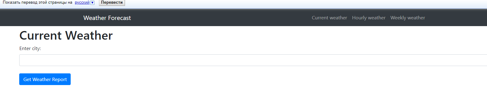
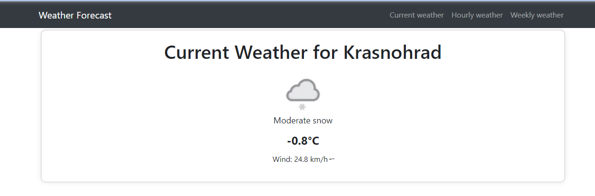
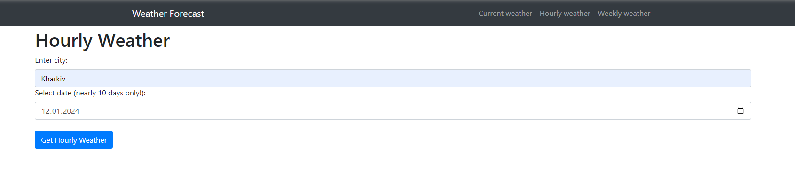
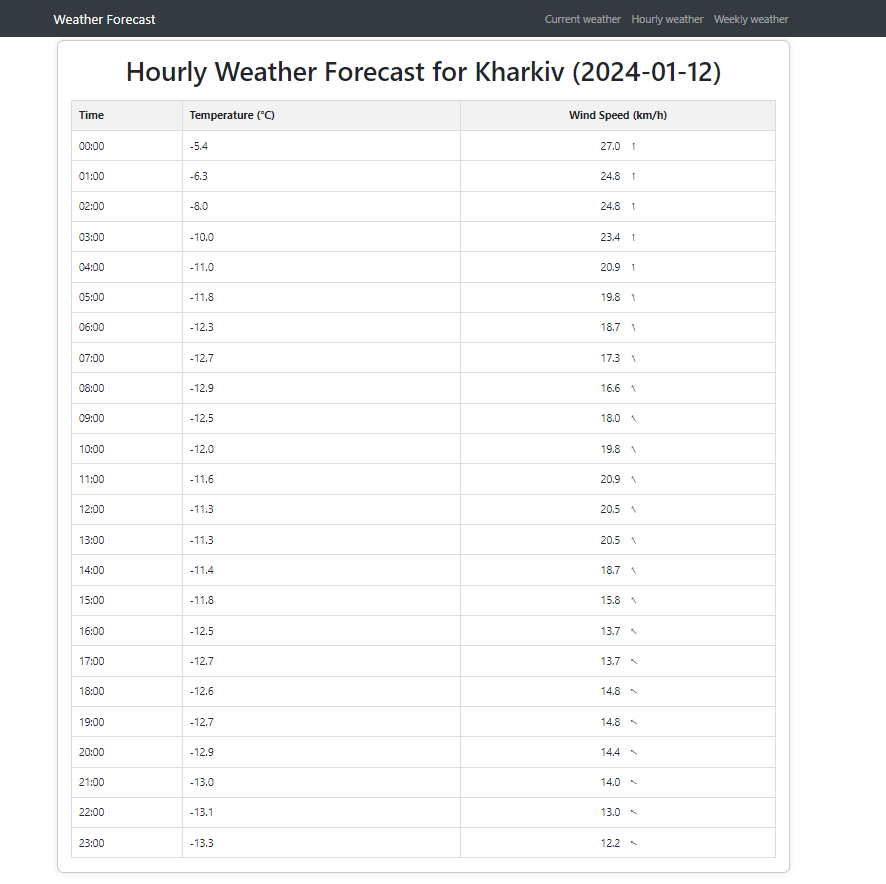
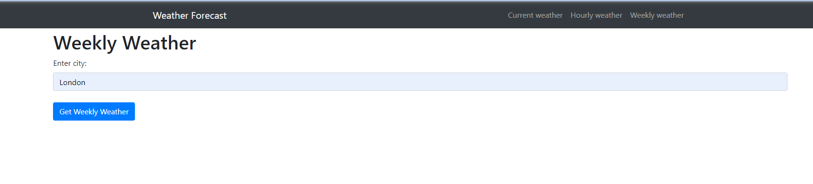
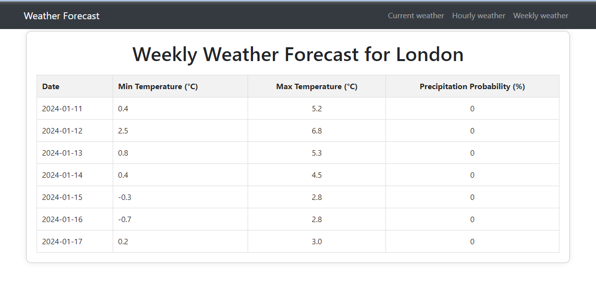

# Weather Forecast client
Application to view current,
hourly or weekly weather using 

https://www.weatherapi.com/ 
(Pro+ package preferred)

# Windows/MacOS install

1. If you are using PyCharm - it may propose you to automatically create venv for your project 
    and install requirements in it, but if not:

    `python -m venv venv`

    `venv\Scripts\activate` (on Windows)

    `source venv/bin/activate` (on macOS)

    `pip install -r requirements.txt`

2. Configure .env file
   

3. Use following command:

   `python manage.py runserver`

# Demo

